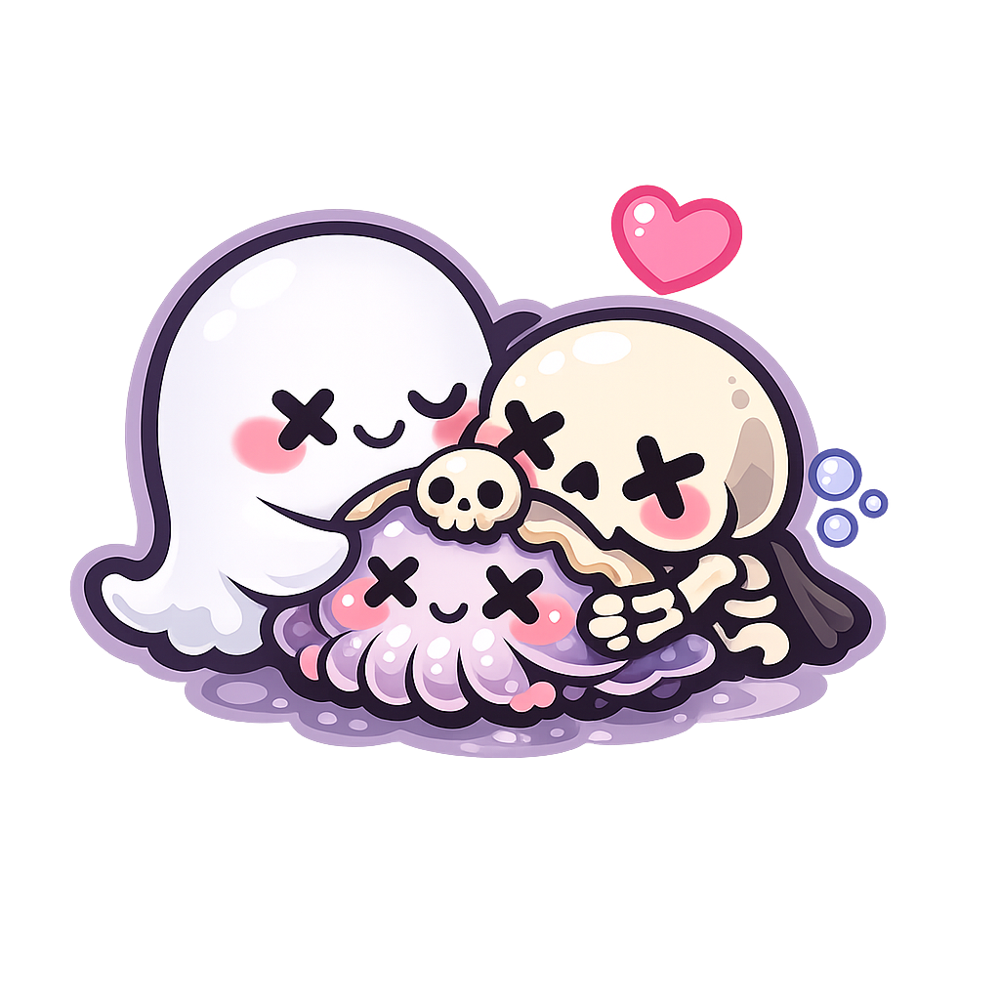

<div align="center">



# dedctl

**Dedctl** is a Dedicated Game Controller for managing Steam game servers on Linux. It provides a web-based dashboard to start, stop, restart, and monitor game servers managed by systemd, along with real-time log streaming.

[Backend](backend/) | [Frontend](frontend/) | [Contributing](CONTRIBUTING.md)

</div>

## Overview

dedctl consists of two components:

- **Backend** (`backend/dedctl/`) — A Go CLI tool and REST API that interacts with systemd to manage Steam game servers (`steam-<game>.service`), handle authentication via JWT, serve game cover images, and stream logs via systemd journal.
- **Frontend** (`frontend/games-frontend/`) — A SvelteKit web application with a dark-themed dashboard for game server management, login, and log viewing.

## Quick Start

### Prerequisites

- Go 1.26.1 or higher
- Node.js 18+ and npm
- Linux system with systemd and user D-Bus
- Steam game servers running as systemd user services (`steam-<game>.service`)

### Backend

```bash
cd backend/dedctl
go mod tidy
go run main.go server
```

### Frontend

```bash
cd frontend/games-frontend
cp .env.example .env  # Set VITE_API_BASE_URL=http://127.0.0.1:8080 — the URL where the backend API is running
npm install
npm run dev
```

Open [http://localhost:5174](http://localhost:5174) to access the dashboard.

### Setup

After cloning, copy the config and metadata files to your home directory:

```bash
mkdir -p ~/.dedctl
cp backend/dedctl/configs/config.yaml ~/.dedctl/
cp backend/dedctl/configs/metadata.yaml ~/.dedctl/
```

Edit `~/.dedctl/config.yaml` to set your own JWT secret key and password hashes (generate them with `dedctl hash <password> sha512`).

> **Note:** `VITE_API_BASE_URL` must point to the address and port where the backend is listening. If the backend is running on the same machine, use `http://127.0.0.1:8080` (or whichever port you configured). If the frontend and backend are on different machines, use the backend's IP address.

## Project Structure

```
dedctl/
├── backend/dedctl/          # Go backend
│   ├── cmd/dedctl/          # CLI commands (hash, cache-images)
│   ├── internal/
│   │   ├── app/             # Server setup and routing
│   │   ├── config/          # Configuration and metadata loading
│   │   ├── handler/         # HTTP request handlers
│   │   ├── service/         # Business logic (game, auth, images)
│   │   └── utils/           # JWT utilities
│   ├── configs/             # Default config and metadata files
│   └── main.go
├── frontend/games-frontend/ # SvelteKit frontend
│   ├── src/
│   │   ├── lib/             # API client, stores, assets
│   │   └── routes/          # Pages (login, dashboard, game details, logs, admin)
│   └── static/
├── CONTRIBUTING.md
└── Makefile
```

## Architecture

```
┌──────────────┐     HTTP/REST      ┌────────────────┐     systemd D-Bus    ┌──────────────┐
│   Frontend   │ ◄────────────────► │   Backend API   │ ◄──────────────────► │  systemd      │
│  SvelteKit   │     API calls      │   Go + Gorilla  │   service mgmt      │  user session │
│              │                    │                 │   journal streaming │               │
└──────────────┘                    └────────────────┘                     └──────────────┘
```

## Configuration

The backend configuration file (`~/.dedctl/config.yaml`) defines:

- **Server** — host, port, and CORS origins
- **JWT** — secret key and token expiry
- **Game** — base path for game servers
- **Users** — usernames, password hashes, and admin flags

## API Endpoints

| Method | Endpoint | Description | Auth |
|--------|----------|-------------|------|
| POST | `/auth/login` | Authenticate and get JWT | No |
| GET | `/server-info` | Get global server metadata | No |
| GET | `/games` | List all game servers | Yes |
| POST | `/games/{game}/start` | Start a game server | Yes |
| POST | `/games/{game}/stop` | Stop a game server | Yes |
| POST | `/games/{game}/restart` | Restart a game server | Yes |
| GET | `/games/{game}/status` | Get game server status | Yes |
| GET | `/games/{game}/logs` | Stream logs (SSE) | Yes |
| PATCH | `/games/{game}/metadata` | Update game metadata | Yes |
| POST | `/games/{game}/update-art` | Download game cover art | Yes |
| PATCH | `/games/settings` | Update global settings | Yes |
| GET | `/images/{name}` | Serve game cover images | No |

## License

See [LICENSE](LICENSE).
